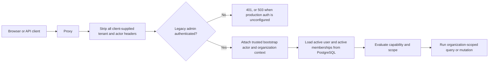

# SermonClip Phase 1A — Trust Foundation Implementation

**Status:** Implemented and verified

**Date:** 2026-07-29
**Roadmap parent:** [SermonClip 2026 Major Upgrade Strategy](./sermonclip-2026-major-upgrade-strategy.md)

## Outcome

Phase 1A establishes the first deployable boundary between the legacy
single-admin product and a multi-church SaaS platform. It does not declare the
full Phase 1 exit gate complete. It creates the tenant data model, a staged
legacy-data migration, centralized authorization, trusted request context,
persisted membership enforcement, and an organization-scoped vertical slice
through the dashboard, sermon library, sermon review/studio, upload, deletion,
and Brand Kit.

## Implemented

### Tenant and identity schema

- `Organization` and `Campus`
- `User` and `UserProfile`
- expiring `Membership` records with the approved 10-role model
- hashed-token `Invitation` records
- actor-attributed `AuditEvent` records, with current application workflows
  exposing insert-only audit behavior
- hashed-token `OwnershipTransfer` records
- `OrganizationEntitlement` and idempotent `UsageEvent` foundations
- organization and campus keys on the current sermon, content, publishing,
  social, AI, analytics, and growth roots
- organization-owned Brand Kits with one Brand Kit per organization

The forward migration creates a compatibility tenant and backfills all existing
customer-owned records:

- organization: `org_local_default`
- campus: `campus_local_default`
- bootstrap owner: `user_local_bootstrap`

PostgreSQL partial unique indexes prevent duplicate organization-wide
memberships, duplicate pending invitations, and concurrent pending ownership
transfers where nullable scope columns would otherwise weaken ordinary unique
indexes.

### Authorization

The centralized policy engine defines 43 capabilities across:

- `OWNER`
- `ORG_ADMIN`
- `CAMPUS_ADMIN`
- `PASTOR_APPROVER`
- `CONTENT_LEAD`
- `EDITOR`
- `PUBLISHER`
- `ANALYST`
- `VIEWER`
- `EXTERNAL_CONTRACTOR`

Authorization is fail-closed across organization, campus, and exact-resource
scope. Theology approval and public publishing are deliberately separate
capabilities. External contractor access must be scoped and time-limited.

### Trusted request boundary

Public and automation routes receive no human actor context. At this Phase 1A
checkpoint, the Basic Auth bridge could establish only the fixed migration
identity; the later Phase 1B implementation disabled that bridge in production
and replaced it with per-user revocable sessions. An unknown, suspended,
revoked, expired, inactive-tenant, cross-organization, cross-campus, or
client-asserted identity is denied.

### Organization-scoped vertical slice

The following paths now take organization and selected-campus identity from
trusted request context:

- dashboard sermon list and operational metrics
- Sermon Library enumerate/search/filter
- sermon detail
- Pastor Review
- Clip Studio sermon/clip load
- server-action sermon creation
- raw/chunked upload creation, continuation, and finalization
- sermon deletion entry point and related publishing cleanup scan
- Brand Kit read, create, update, logo delivery, and clip invalidation

Sermon creation and deletion—including raw upload-session creation—write
actor-attributed audit events in the same database transaction as the core
mutation. Upload requests without trusted tenant identity are rejected before
storage or database work begins.

### Runtime quality repair

Brand Kit browser code no longer imports a Prisma-owning server module.
Browser-safe settings contracts now live in a shared library. The Playwright
suite uses outcome-based assertions for the current UI and explicitly verifies
Brand Kit HTTP success, hydration, interactive controls, a completed save
action, and absence of browser runtime errors. Users with `brand.read` but not
`brand.manage` receive a visibly disabled, view-only editor.

## Verified

- safe deployment rehearsed successfully against both the existing isolated
  PostgreSQL schema and a disposable clean PostgreSQL database
- clean-database verification confirmed all 47 migration-history records, the
  bootstrap organization/campus/user/membership, and all four Phase 1 partial
  indexes
- Prisma format, validation, and client generation
- TypeScript check
- ESLint
- production Next.js build
- 2,258 tests passed; 2 intentionally skipped
- database integration tests for sermon creation, audit creation, deletion,
  audit deletion history, and two-organization sermon/Brand Kit isolation
- 4/4 Playwright smoke tests passed, including desktop workflow, Brand Kit,
  health, and mobile navigation

## Security guarantees in this slice

- A client cannot choose its organization or actor by sending internal headers.
- Production fails closed when the legacy administrator credential is absent.
- Application authorization reads active user and membership state from the
  database.
- The covered sermon queries include organization and selected-campus
  predicates; Brand Kit is deliberately organization-owned.
- The same resource ID queried under another organization returns no record.
- Brand changes invalidate only clips belonging to that organization.
- Clip Studio preview and export preparation resolve the Brand Kit from the
  sermon's organization.
- Dashboard operational totals are organization-scoped.
- Core sermon create/delete operations are tenant-attributed in the audit log.

## Phase 1 is not complete

The following remain hard launch gates. Until they are complete, SermonClip
must not claim general multi-tenant production readiness:

1. Replace the Basic Auth migration bridge with production identity: provider
   identities, secure sessions, email verification, MFA, recovery, rotation,
   and session revocation.
2. Scope every remaining route, server action, repository, worker, background
   job, cache lookup, social connector, export, analytics query, and support
   operation. Several existing roots have tenant columns but legacy writers
   still rely on the transitional default.
3. Remove transitional `org_local_default` database defaults and make all
   customer-owned `organizationId` columns non-null after every writer is
   request- or job-context aware.
4. Add composite database constraints proving every `campusId` belongs to the
   row's `organizationId`, then add PostgreSQL row-level security and a
   transaction-local tenant setting as defense in depth.
5. Make object keys tenant-prefixed and move durable customer media to private
   object storage with signed access, retention, deletion, and malware/media
   validation controls.
6. Promote database-polled processing into a managed durable queue with
   tenant-aware, idempotent worker claims and failure recovery.
7. Enforce entitlements and usage limits before every expensive AI/media
   operation.
8. Implement invitation acceptance, offboarding, ownership transfer,
   organization claiming, emergency recovery workflows and UI, plus
   database-enforced audit immutability and durable actor snapshots.
9. Make social account and credential uniqueness tenant-aware; complete
   encryption/key-rotation and disconnect/revocation behavior.
10. Add SSO-ready identity linking, security notifications, observability,
    tenant dashboards, backup restoration, and incident drills.

## Phase 1B execution order

1. Production sessions, identity linking, MFA, recovery, and bootstrap-owner
   claim flow.
2. A tenant-aware repository layer and mandatory authorization wrappers for
   every user-facing read and mutation.
3. Tenant propagation through processing jobs, AI calls/cache, content assets,
   publishing, social credentials, analytics, and object keys.
4. Invitation, offboarding, and ownership-transfer services plus audit
   coverage.
5. Entitlement checks and usage ledger enforcement.
6. Non-null tenant hardening migration, removal of legacy defaults, and RLS.
7. Private object storage, managed workers, observability, restore drills, and
   the three-pilot-church isolation exercise.

## Deployment notes

Before applying the migration to a production database:

1. Take and verify a restorable backup.
2. Rehearse the exact migration against a current production snapshot.
3. Run `node scripts/prisma-safe-deploy.mjs`; do not use `prisma db push`
   directly. The deploy helper distinguishes fresh, current-historyless, and
   legacy databases, applies the Phase 1 bootstrap invariants, and establishes
   migration history before normal `migrate deploy`.
4. Verify the backfill count for every customer-owned root and confirm there
   are no null, orphaned, or cross-campus references.
5. Deploy the Phase 1A code and confirm the bootstrap owner can access the
   default organization.
6. Claim the bootstrap owner through the future identity onboarding flow; the
   `.invalid` bootstrap email must never be treated as deliverable.
7. Monitor authorization denials, query errors, upload failures, job failures,
   and audit-event write failures during rollout.
