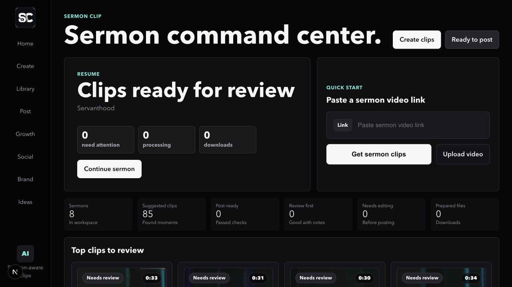
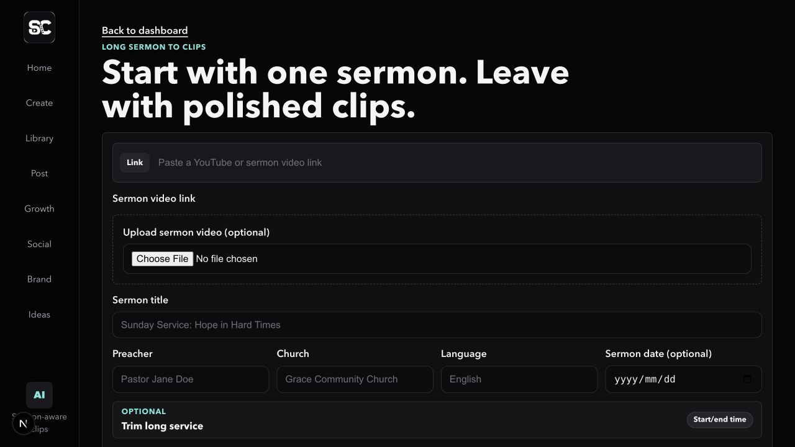
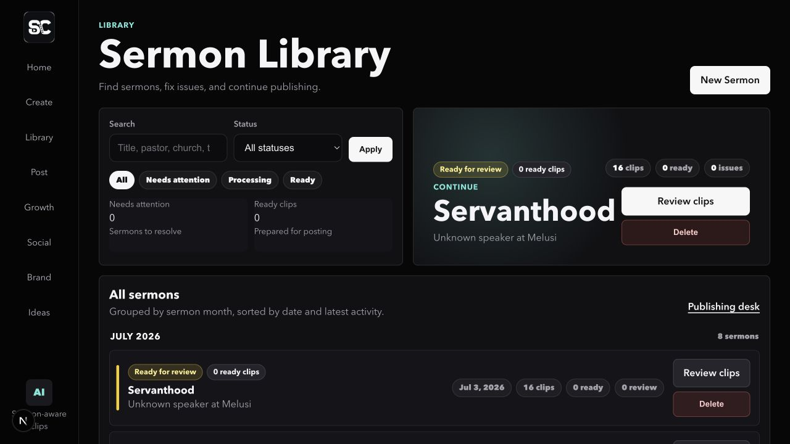
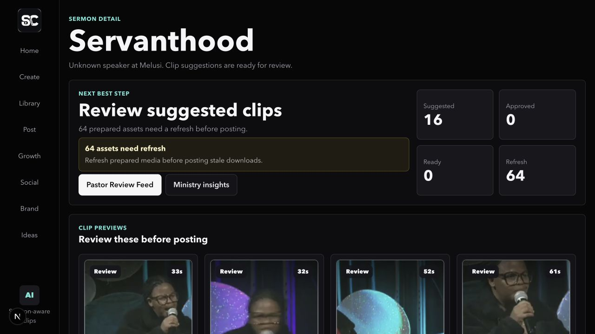
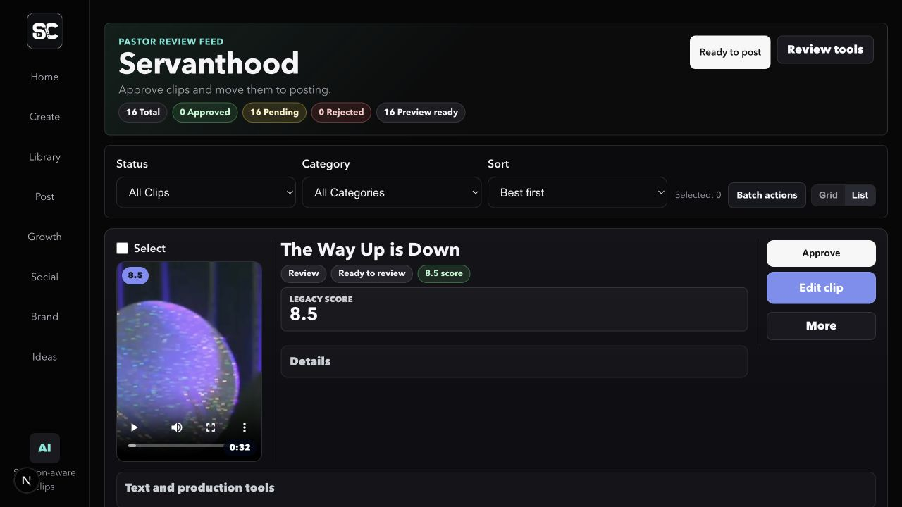
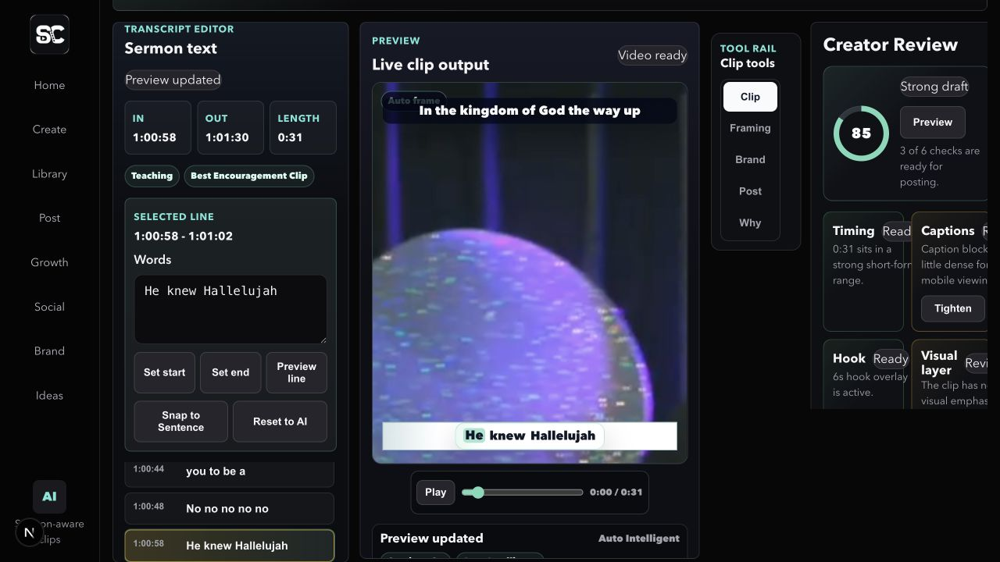
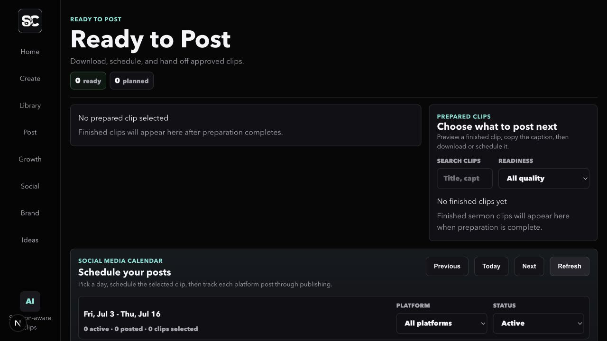
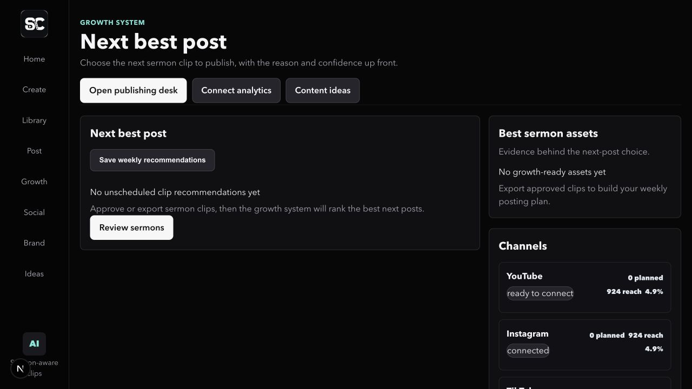
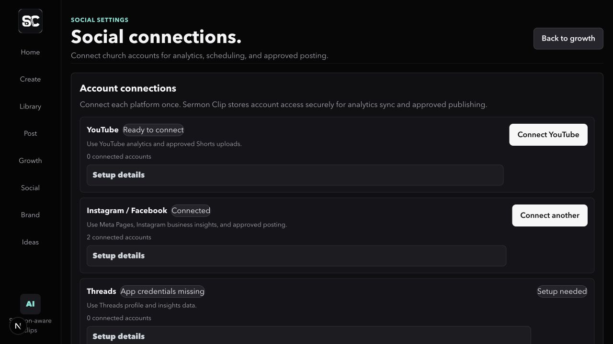
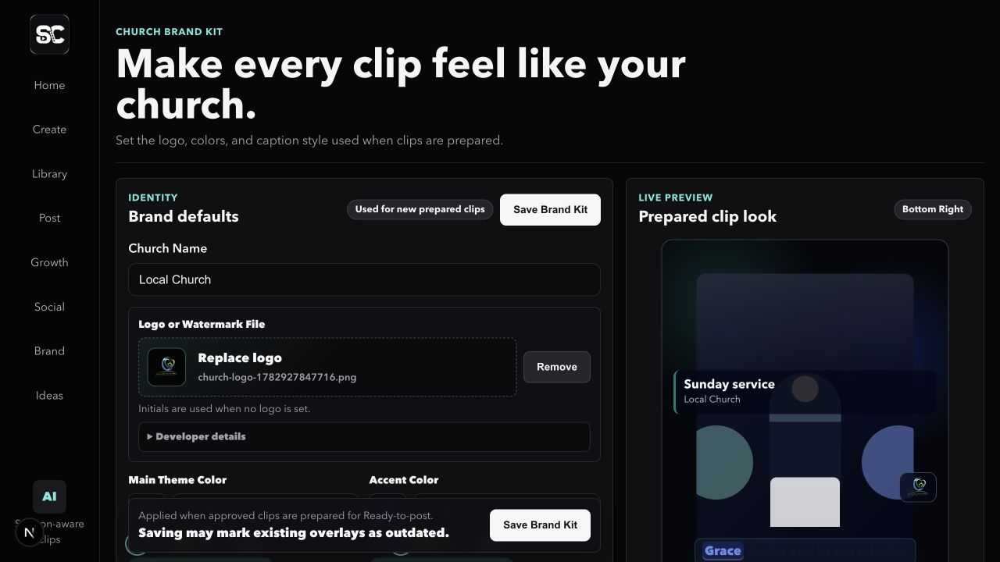

# Sermon Clip Product Brief and Notes Pack

Date: 2026-07-03

This pack consolidates the current product story, feature inventory, screenshot set, roadmap, competitor notes, clip quality notes, architecture notes, pricing ideas, and user/church feedback signals for Sermon Clip.

## Product Brief

Sermon Clip turns long-form church sermons into ready-to-post short clips for pastors and church media teams.

The core promise is: upload one sermon, find the best ministry moments, review them safely, prepare branded vertical clips, and hand them off for posting without making a pastor manage media-pipeline steps.

Target users:

- Pastors who want faithful sermon moments on social media but do not want to become video editors.
- Church media volunteers who need a weekly, repeatable workflow.
- Communications teams that need captions, church branding, posting copy, and scheduling support.
- Small churches that need a local-first tool before committing to full cloud production.

Primary workflow:

1. Add a sermon by upload or video link.
2. Process the sermon into transcript and clip candidates.
3. Review the best moments in a pastor-facing review feed.
4. Approve, reject, or edit clips.
5. Prepare approved clips with captions, branding, render, and export.
6. Download or schedule finished clips from Ready To Post.

Positioning:

- More church-specific than generic creator clipping tools.
- More workflow-focused than a pure AI highlight generator.
- More pastor-safe than tools that optimize only for virality.
- Currently strongest as a local-first weekly production desk.

Differentiators:

- Ministry-first clip scoring: usefulness, standalone clarity, sermon value, context safety, and pastoral confidence.
- Church Brand Kit: logo, watermark, colors, lower thirds, and caption style defaults.
- Pastor-friendly workflow language instead of render/export/caption-burn terminology.
- Review-first safety loop: human approval is required before posting/export.
- Clip Studio for transcript-based edits without becoming a full nonlinear editor.
- Local Mac worker model for heavy media work and future posting automation.

## Feature List

### Sermon intake

- Create sermon records.
- Upload local sermon video.
- Paste sermon/video link.
- Store church name, preacher, title, language, and date.
- Optional start/end trimming for long services.
- Rights/permission reminder in intake flow.
- Pastor-facing pending/progress state during submission.

### Media processing

- Local sermon storage setup.
- YouTube/video download via `yt-dlp`.
- Audio extraction via FFmpeg.
- OpenAI transcription with segment timestamps.
- One-click pre-review processing pipeline.
- Operation status, retry, and recovery messaging.

### Clip discovery and intelligence

- AI-powered clip suggestion generation.
- Sermon-aware ministry categories such as prayer, encouragement, scripture explanation, salvation invitation, testimony, and quote-worthy moments.
- Audience labels and pastor-facing reasons.
- Boundary refinement.
- Duration quality scoring.
- Completeness review for standalone clarity.
- Hook analysis and hook adjustment.
- Context-risk warnings.
- Subject and speaker tracking for future framing and context features.

### Pastor review feed

- Video-first review cards.
- Approve, reject, and edit actions.
- Batch selection and batch actions.
- Filters by status and category.
- Sorting by best-first quality.
- AI score, ministry value, audience, category, and safety context.
- Large Preview/Pause overlays and poster-first preview behavior.
- Hover preview and keyboard-friendly card focus on supported surfaces.
- Pastor-friendly feature preview modals for future social/schedule/B-roll actions.

### Clip Studio

- Transcript-based clip editing.
- Start/end spoken-line selection.
- Manual timing precision controls.
- Live vertical preview.
- Caption controls.
- Hook/workbench tabs.
- Format and framing controls.
- Smart Crop / pastor tracking support.
- Brand overlay controls.
- Creator-review checklist for timing, captions, hook, visual layer, and posting readiness.

### Captions, branding, and export

- Caption generation.
- Caption burn-in.
- Fallback caption rendering when FFmpeg lacks subtitle filter support.
- Church Brand Kit overlay.
- Lower third and watermark treatment.
- Caption style presets.
- Vertical 9:16 export.
- Download endpoint for final MP4.
- Stored poster/thumbnail metadata for prepared clips.
- Thumbnail backfill from Workspace Readiness.

### Ready To Post

- Finished clip queue.
- Best available preview per clip.
- Individual clip download.
- Batch ZIP posting packages.
- Platform caption text files.
- Hashtags and platform caption variants.
- `posting-manifest.json` in packages.
- Estimated media size where available.
- Posting package history and re-download.
- Posting draft creation.
- Scheduled post rows.
- Calendar-style scheduling view.
- Church social account placeholders.
- YouTube/TikTok/Meta/Threads connector readiness surfaces.

### Growth and content planning

- Growth cockpit route.
- Platform/channel readiness.
- Estimated reach and engagement outlook.
- Growth-ready clip count.
- Recommendations, campaigns, guardrails, and analytics concepts.
- Content opportunities and ministry pattern pages.
- Knowledge base surfaces for reusable sermon intelligence.

### Operations and recovery

- Health page.
- Workspace readiness.
- Pastor-friendly error mapping.
- Failed job retry controls.
- Live progress panel on sermon detail.
- Ready queue live status panel.
- Local media worker architecture.
- Operational diagnostics for storage and data consistency.

### Current non-goals or not-yet-complete areas

- Full authentication and roles.
- Payments/subscriptions.
- Full cloud storage and multi-user production hosting.
- Direct OAuth publishing to all platforms from the main app.
- Queue-backed long-running media orchestration.
- Automatic approval of clips.

## Screenshots

Fresh screenshots were captured from the local app at `http://localhost:3010` on 2026-07-03 and saved under `artifacts/screenshots/product-pack/`.

### Dashboard

### Create Sermon

### Sermon Library

### Sermon Detail

### Pastor Review Feed

### Clip Studio

### Ready To Post

### Growth

### Social Settings

### Branding Settings

## Roadmap

### Immediate product polish

- Make the first-screen action hierarchy quieter: one primary action per major area.
- Simplify repeated explanatory copy across dashboard, review, ready queue, and growth.
- Collapse advanced controls in Clip Studio and Brand settings.
- Improve poster-generation status states directly inside clip grids.
- Add richer fallback artwork when clip media is unavailable.
- Improve metadata spacing in review cards.
- Rename remaining technical labels such as "Regeneration" to user-goal language like "Refresh ideas".
- Finish mobile priority cleanup by reducing top-rail vertical cost.

### Near-term competitive upgrades

- Guaranteed optimized poster variants, preferably WebP/AVIF when encoder support exists.
- Database-backed posting package history for multi-user readiness.
- OAuth-backed social account connection model.
- Direct platform publishing where APIs allow it.
- Per-platform filename conventions and package summaries.
- Estimated download time and output-size hints.
- Model-backed AI hook generation using transcript, audience, category, and sermon context.
- Persisted hook history and selected-hook metadata.
- Safety scoring before final hook save.
- Matching hook refinement inside Clip Studio.
- Push or server-sent progress updates instead of route-refresh polling.

### Technical hardening

- Establish clean Prisma migration baseline.
- Add CI guard for migration drift.
- Centralize operation telemetry and correlation IDs.
- Add typed workflow state machine for clip transitions.
- Add queue-backed execution for long-running media work.
- Add storage cleanup for stale partial files and obsolete regenerated outputs.
- Add end-to-end weekly workflow integration test.
- Add tests for retry and concurrent action contention.

### Later platform expansion

- Auth, organizations, roles, and team permissions.
- Multi-campus / network accounts.
- Cloud media storage with retention policies.
- Direct integrations with church media folders, Zoom, Google Drive, and livestream sources.
- Content multiplication suite: devotionals, discussion guides, blogs, quote cards, carousel ideas, Bible verse posts, and sermon pages.
- Multilingual translation and caption workflows.
- Analytics learning loop from posted clip outcomes.
- Billing and usage limits by sermon hours, exports, or church seats.

## Opus Clip and Sermon Shots Comparison Notes

### Opus Clip

Source checked: official OpusClip home and pricing pages on 2026-07-03.

Public positioning:

- Broad AI clipping and editing tool for creators, podcasters, marketers, agencies, livestreamers, churches, e-commerce, real estate, and media teams.
- Core promise: turn one long video into multiple short clips and publish across social platforms.
- Major features include ClipAnything, animated captions, AI Reframe, AI B-roll, social scheduler, brand templates, AI editor, XML export for Premiere Pro / DaVinci Resolve, team workspace, and thumbnail generation.

Pricing observed:

- Free: $0/month, 60 credits/month, watermark, 1080p clips, export availability limit.
- Starter: $15/month, 150 credits/month, individual creators, no annual option shown.
- Pro: $29/month monthly or $14.50/month billed annually at $174/year, 3,600 credits/year, 2-seat team workspace, 2 brand templates, 6 social account connections, B-roll, multiple input sources, scheduler, custom fonts, speech enhancement, limited API access.
- Business: custom pricing with customized credits, team seats, social account connections, priority processing, tailored assets, dedicated storage, API/custom integrations, MSA, priority support, and enterprise security.

Implications for Sermon Clip:

- Opus sets the bar for speed, polish, social scheduling, broad import sources, captions, reframing, and brand templates.
- Sermon Clip should not try to out-generalize Opus. The stronger lane is church context, pastoral safety, sermon-aware review, and weekly church workflow.
- Opus pricing makes $15-$29/month feel normal for generic creator tooling, but church-specific value can likely support $49-$99/month if it saves weekly staff/volunteer time and produces trusted outputs.

### Sermon Shots

Source checked: official Sermon Shots website on 2026-07-03.

Public positioning:

- Church-specific AI tool to repurpose sermons into clips and other church content.
- Claims use by 8,000+ churches.
- Offers social content and discipleship content, not only clips.

Feature claims observed:

- AI-suggested sermon clips.
- AI Camera Crew to keep the pastor centered.
- Upload via livestream, YouTube, or local file.
- Full transcription.
- Search sermon like a word document.
- Cut video by choosing sentences.
- Music, hook animations, smart search, social descriptions, and custom templates.
- Broader outputs: quotes, thumbnails, carousel ideas, Bible verse content, blog posts, 5-day devotionals, and discussion guides.

Pricing observed:

- 2 Free Clips: free, no credit card required.
- Plus: $49.99/month monthly, or $39.99/month paid yearly ($479.88/year). Includes unlimited sermon clips, full sermon transcription, podcast audio, and 10 hours of video uploads per month.
- Silver Suite: $67/month monthly, or $57/month paid yearly ($684/year). Adds shareable sermon pages, discussion guides, summaries, blog post generator, livestream upload, quotes and verses, devotionals, quote images, thumbnails, and carousel generator.
- Gold Suite: $97/month monthly, or $87/month paid yearly ($1044/year). Adds text translations, access to Sermon Send, and full suite access.

Implications for Sermon Clip:

- Sermon Shots is the closest category benchmark.
- Their breadth shows that churches value "sermon repurposing" beyond video clips.
- Their price range suggests Sermon Clip can anchor a real paid plan around $49/month for weekly clips and $79-$99/month for growth/content suite features.
- Sermon Clip needs sharper proof around clip quality, workflow reliability, and pastor-safe review to compete with a tool already trusted by churches.

### Competitive Summary

Sermon Clip is currently strongest where generic tools are weakest: ministry vocabulary, pastoral safety, sermon context, church branding, and weekly handoff workflow.

The biggest competitive gaps are:

- More polished direct publishing and social scheduling.
- Richer multipurpose sermon outputs.
- More obvious "first clip in minutes" onboarding.
- More robust cloud/team/account model.
- Better marketing proof and external church testimonials.

The best differentiation bet:

- Become the most trusted church clipping workflow, not just the fastest clipping model.
- Make "pastor can confidently post this" the core quality standard.

## Clip Quality Review Notes

Current scoring concepts in the app:

- Hook strength.
- Standalone clarity.
- Emotional/spiritual impact.
- Sermon value.
- Shareability.
- Context safety.
- Boundary quality.
- Duration quality.
- Visual readiness / smart crop confidence.

Current warning concepts:

- Weak hook.
- Incomplete thought.
- Context risk.
- Awkward boundary.
- Weak visual confidence.
- Low post-worthiness.
- Missing setup or missing landing.
- Smart crop instability.
- Pastor not centered.
- Render missing or failed.
- Audio missing.
- Output duration or dimension mismatch.

Pastor-facing quality labels:

- Strong post-ready clip.
- Worth reviewing.
- Weak post candidate.
- Good, review first.
- Needs pastor review.
- May need more context.
- Context needs review.
- Video looks ready.
- Check framing.

Current local dataset observations from screenshots:

- Dashboard shows 8 sermons and 85 suggested clips.
- Dashboard currently shows 0 post-ready and 0 prepared files.
- The "Servanthood" review feed shows 16 total clips, 0 approved, 16 pending, and 16 preview ready.
- Review cards show strong legacy scores such as 8.5, but the visible surface should continue moving toward the richer professional quality score dimensions.
- Clip Studio creator review shows a strong draft score in the screenshot, but some checklist items still need human review.

Quality bar recommendation:

- Do not equate viral potential with post readiness.
- Treat any context risk, incomplete thought, or ambiguous pronoun opening as review-required.
- Require strong hook, clear landing, safe context, readable captions, centered framing, and usable audio before "Ready to post".
- Keep a pastor in the loop for theological/context decisions even when the AI score is high.

## Technical Architecture Notes

Stack:

- Next.js App Router.
- React.
- TypeScript.
- Prisma.
- Postgres metadata database for production/Vercel and worker scheduling.
- Local filesystem storage for sermon media.
- FFmpeg for audio extraction, rendering, caption burn, and exports.
- `yt-dlp` for video download.
- OpenAI for transcription and clip/sermon intelligence.
- Sharp for image/poster work.
- TensorFlow COCO-SSD/TensorFlow.js for visual tracking experiments.
- Local Mac media and posting workers.
- S3/R2-compatible integration work is present for remote preview/publishing paths.

Important app routes:

- `/` dashboard.
- `/sermons/new` create sermon.
- `/sermons` sermon library.
- `/sermons/[id]` sermon detail.
- `/sermons/[id]/review` pastor review feed.
- `/sermons/[id]/intelligence` sermon intelligence.
- `/sermons/[id]/clips/[clipId]/studio` Clip Studio.
- `/ready-to-post` finished clip queue and scheduling.
- `/growth` growth cockpit.
- `/settings/social` social account readiness.
- `/settings/branding` Church Brand Kit.
- `/opportunities` content opportunities.
- `/health` workspace readiness and health checks.

Key API routes:

- `/api/clips/[id]/preview`.
- `/api/clips/[id]/download`.
- `/api/clips/[id]/thumbnail`.
- `/api/ready-to-post/download`.
- `/api/ready-to-post/drafts`.
- `/api/ready-to-post/scheduled-posts`.
- `/api/automation/upcoming`.
- `/api/social-accounts`.
- OAuth callbacks for YouTube, TikTok, Meta, and Threads.

Core pipeline:

1. Create sermon metadata.
2. Store source video from upload or download.
3. Extract audio.
4. Transcribe sermon with timestamps.
5. Generate sermon intelligence.
6. Generate clip candidates.
7. Refine boundaries.
8. Review completeness and professional clip quality.
9. Human approve/reject/edit.
10. Render approved clips.
11. Generate captions.
12. Burn captions.
13. Apply brand overlays.
14. Export vertical clips.
15. Generate/poster metadata.
16. Queue finished clips in Ready To Post.
17. Download package or create scheduled post drafts.
18. Local worker handles platform posting where configured.

Important data models include:

- `Sermon`.
- `BrandingSettings`.
- `ClipCandidate`.
- `ProcessingJob`.
- `SermonIntelligence`.
- `SermonScriptureRef`.
- `SermonStructureSection`.
- `SermonTopicTag`.
- `SermonSubjectTrack`.
- `SermonSpeakerTrack`.
- `ContentOpportunity`.
- `SocialAccount`.
- `SocialCredential`.
- `PostingDraft`.
- `ScheduledPost`.
- `SocialMetricSnapshot`.
- Growth recommendation/campaign/trend models.

Known technical risks:

- Migration history needs a clean baseline before broader deployment.
- Some operation logs are still agent-specific instead of centralized.
- Current local usage assumes a single operator.
- Long-running media work needs queue-backed orchestration.
- Storage cleanup/retention is conservative, so obsolete outputs can accumulate.
- Direct publishing and social account OAuth need more complete production hardening.
- Multi-user auth, roles, billing, and cloud retention policies are not yet in place.

## Pricing Ideas

The competitor range suggests Sermon Clip should price around church workflow value, not generic AI credits.

Recommended packaging:

### Free trial

- 2 sermons or 2 final clips.
- No credit card.
- Watermarked or limited export count.
- Goal: prove clip quality and pastor confidence.

### Starter - $19 to $29/month

- For small churches testing weekly clips.
- 2-4 sermon hours/month.
- Limited final exports.
- Captions, transcript review, manual download.
- Basic Church Brand Kit.
- No direct publishing.

### Weekly Church - $49/month

- Core paid plan.
- 10 upload hours/month or a clear weekly sermon allowance.
- Unlimited suggested clip candidates within usage policy.
- 40-80 final clip exports/month.
- Brand Kit, caption presets, posting packages, platform captions, and Ready To Post.
- Email/basic support.

### Growth Suite - $79 to $99/month

- For churches posting consistently.
- More video hours and exports.
- Scheduled posts and social account connections.
- Growth cockpit.
- Model-backed hooks.
- Content opportunities.
- Quote cards, thumbnails, carousel ideas, blog/devotional/discussion outputs as they ship.
- Team seats.

### Network / Agency - $149 to $299/month

- Multi-campus or church-media agency use.
- Multiple churches/workspaces.
- Approval roles.
- Priority processing.
- More storage/retention.
- Direct publishing.
- Analytics exports.
- White-label or custom brand defaults.

### Add-ons

- Extra video-hour packs.
- Extra export packs.
- Done-for-you clip review.
- Monthly church content pack.
- Migration/import setup.
- Priority support.

Pricing principles:

- Churches understand sermon hours and weekly workflow better than abstract AI credits.
- A "10 hours video uploads/month" anchor matches Sermon Shots' Plus plan.
- Keep the $49 plan simple and credible.
- Put broader content multiplication and analytics into the $79-$99 plan.
- Offer annual discounts but keep monthly accessible for small churches.

## User and Church Feedback

Important caveat: the repo contains QA notes, UX audits, and a user-testing script, but no clear transcript of completed external church interviews. Treat the following as evidence tiers.

### Direct local evidence

- UI audit says the app has a strong product idea and distinctive dark media-workspace direction.
- Strongest surfaces: command-center home, visual clip cards, real video previews, ministry-oriented vocabulary, and Clip Studio.
- Main UX issue: too much information and too many equally weighted actions on many screens.
- Growth page is valuable but too dense.
- Mobile does not show major horizontal overflow in QA, but first-screen priority still needs cleanup.
- MVP 2 usability audit scored: usability 8.4, workflow clarity 8.6, learnability 8.1, pastor friendliness 8.7, production readiness 8.2.
- MVP 2 readiness assessment says the product is suitable for weekly church use in local/dev operation when FFmpeg and OpenAI dependencies are configured.

### User-testing questions already prepared

- What was the first point where you hesitated?
- Which label or message was unclear?
- Did any preview, download, or worker action feel unreliable?
- Would you trust this workflow with a real sermon after this session?

### Likely church feedback themes to validate

- "Can I trust this with a real sermon?"
- "Will it avoid taking my sermon out of context?"
- "Can a volunteer use it every Monday without me?"
- "How quickly can I get the first usable clip?"
- "Does the clip look like our church, not a generic template?"
- "Can I download everything for TikTok, Instagram, YouTube Shorts, and Facebook without re-editing?"
- "Does it help us post faithfully without sounding clickbait?"
- "Can it create devotionals, quote cards, and discussion guides from the same sermon?"

### Public market signal from Sermon Shots

Sermon Shots publicly claims 8,000+ churches and shows testimonials around time savings, content quality, social presence, and engagement lift. This is not feedback for Sermon Clip directly, but it validates that churches already pay for sermon repurposing when the workflow feels trustworthy and fast.

## Source Notes

Local repo sources:

- `README.md`.
- `docs/church-first-platform-plan.md`.
- `docs/opus-sermon-competition-assessment.md`.
- `docs/ui-ux-audit-current.md`.
- `docs/ui-usability-audit-mvp2.md`.
- `docs/mvp2-readiness-assessment.md`.
- `docs/mvp3-technical-debt-review.md`.
- `docs/user-testing-script.md`.
- Current app screenshots under `artifacts/screenshots/product-pack/`.

Web sources checked:

- OpusClip home: https://www.opus.pro/
- OpusClip pricing: https://www.opus.pro/pricing
- Sermon Shots home/pricing: https://sermonshots.com/
